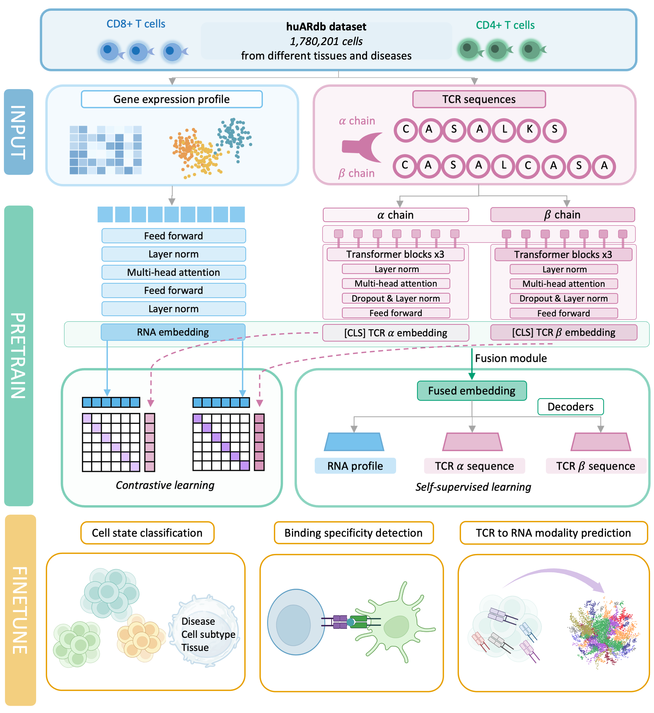

# TCRfoundation

**A multimodal foundation model for single-cell immune profiling**

[](https://opensource.org/licenses/MIT)
[](https://www.python.org/downloads/)

## Overview

TCRfoundation integrates gene expression profiles and T cell receptor (TCR) sequences from paired single-cell measurements. The model uses self-supervised pretraining with masked reconstruction and cross-modal contrastive learning to enable comprehensive immune profiling across three key applications:

- **T-cell state classification**: Predict tissue origin, disease state, and cellular phenotype.
- **Binding specificity detection**: Identify TCR-antigen interactions and quantify binding avidity.
- **Cross-modal prediction**: Infer gene expression from TCR sequences.



## Installation

```bash
git clone https://github.com/Liao-Xu/TCRfoundation.git
cd TCRfoundation
pip install -e .
```

**Requirements**: Python 3.8+, PyTorch 1.13.1+
